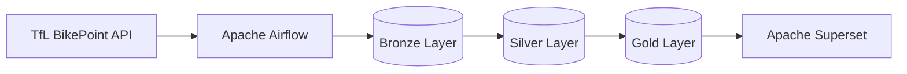

# London BikePoint Analytics

## Äriküsimus

Projekt analüüsib Londoni Santander Cycles (BikePoint) võrgu kasutust reaalajas.

Peamine äriküsimus:

**Millistes Londoni piirkondades tekib suurim rataste defitsiit ja milline on rattajaamade tühjenemise kiirus?**

Projekt aitab tuvastada suure nõudlusega rattajaamu, et toetada rataste ümberpaigutamise ja võrgu optimeerimise otsuseid.

### Mõõdikud

1. Current Bike Availability (saadaolevate rataste arv jaama kohta)
2. Bike Demand per Hour (rataste vähenemise kiirus tunnis)
3. Top 10 Stations by Bike Demand (viimase 24 tunni suurima nõudlusega jaamad)

---

## Arhitektuur



Andmed kogutakse Transport for London (TfL) BikePoint API-st iga 5 minuti järel. Airflow orkestreerib andmevoogu ning dbt teostab transformatsioonid Silver ja Gold kihtidesse.

---

## Andmestik

| Allikas           | Tüüp     | Ajas muutuv?            | Roll             |
| ----------------- | -------- | ----------------------- | ---------------- |
| TfL BikePoint API | REST API | Jah, iga 5 minuti järel | Põhiandmeallikas |

Andmestik sisaldab:

* jaama nimi
* geograafilised koordinaadid
* saadaolevate rataste arv
* vabade dokkide arv
* andmete ajatempel

---

## Stack

| Komponent        | Tööriist        |
| ---------------- | --------------- |
| Sissevõtt        | Python          |
| Orkestreerimine  | Apache Airflow  |
| Transformatsioon | dbt             |
| Andmehoidla      | PostgreSQL      |
| Visualiseerimine | Apache Superset |
| Konteinerid      | Docker Compose  |

---

## Käivitamine

```bash
git clone <repository-url>

cd London-BikePoint-Analytics

docker compose up -d --build
```

Teenused:

* Airflow: http://localhost:8080
* Superset: http://localhost:8088
* PostgreSQL: localhost:5432

Vaikimisi kasutajad:

```text
username: admin
password: admin
```

---

## Andmevoog lühidalt

### 1. Sissevõtt

Python skript kogub BikePoint API andmeid iga 5 minuti järel.

### 2. Bronze kiht

Toorandmed salvestatakse PostgreSQL andmebaasi.

### 3. Silver kiht

dbt puhastab ja standardiseerib andmed.

### 4. Gold kiht

Luuakse analüütilised mudelid:

* gold_station_latest
* gold_station_depletion_rate

### 5. Testimine

dbt testid kontrollivad andmekvaliteeti automaatselt pärast transformatsioone.

### 6. Näidikulaud

Superset kuvab:

* Current Bike Availability Map
* Top 10 Stations by Bike Demand per Hour (Last 24 Hours)

---

## Andmekvaliteedi testid

Projekt sisaldab järgmisi dbt teste:

### Test 1

Kontrollib, et rataste arv ei oleks negatiivne.

```sql
nb_bikes >= 0
```

### Test 2

Kontrollib, et jaamade koordinaadid jääksid Londoni piirkonda.

```sql
latitude between 51 and 52
longitude between -1 and 1
```

### Test 3

Kontrollib, et nõudluse mõõdik ei oleks negatiivne.

```sql
bike_demand_per_hour >= 0
```

Kõik testid käivitatakse automaatselt Airflow DAG-is.

---

## Superset Dashboardi Importimine

Superseti dashboardid salvestatakse Superseti metabaasi ning neid ei taastata automaatselt pärast uue keskkonna käivitamist.

Seetõttu on projekti juurde lisatud dashboardi ekspordifail:

```text
superset/london_bikepoint_dashboard.zip
```

Dashboardi importimiseks:

1. Käivita projekt Docker Compose abil.
2. Ava Apache Superset.
3. Vali **Dashboards → Import Dashboard**.
4. Impordi fail `london_bikepoint_dashboard.zip`.

Dashboard sisaldab järgmisi visualiseeringuid:

- Current Bike Availability Map
- Top 10 Stations by Bike Demand per Hour (Last 24 Hours)

Dashboard kasutab järgmisi andmestikke:

- `public_gold.gold_station_latest`
- `public_gold.gold_station_depletion_rate`

---

## Dashboard

### Current Bike Availability Map

Kuvab Londoni rattajaamade hetkeseisu.

Näitab:

* jaama asukohta
* saadaolevate rataste arvu

### Top 10 Stations by Bike Demand per Hour (Last 24 Hours)

Kuvab jaamad, kus rataste arv vähenes viimase 24 tunni jooksul kõige kiiremini.

See aitab tuvastada kõrge nõudlusega piirkonnad.

---

## Turvalisuse Märkused

Projekt on loodud õppeeesmärgil ning töötab täielikult lokaalses Docker keskkonnas.

PostgreSQL, Airflow ja Superset kasutajanimed ning paroolid on määratud otse failis `docker-compose.yml`.

See otsus tehti teadlikult, et lihtsustada projekti käivitamist, testimist ja reprodutseeritavust õppekeskkonnas.

Projekt ei sisalda tootmiskeskkonna paroole, API võtmeid, isikuandmeid ega muud tundlikku informatsiooni.

Tootmiskeskkonnas oleks soovitatav hoida kõik autentimisandmed `.env` failides või kasutada spetsiaalset secrets management lahendust.

---

## Projekti struktuur

```text
.
├── airflow/
│   └── dags/
│       └── bikepoint_pipeline.py
│
├── dbt/
│   └── london_bikepoint/
│       ├── models/
│       │   ├── silver/
│       │   └── gold/
│       ├── tests/
│       ├── profiles/
│       └── dbt_project.yml
│
├── docs/
│   └── arhitektuur.md
│
├── scripts/
│   └── ingest_bikepoints_raw.py
│
├── superset/
│   └── dashboard_export_*.zip
│
├── docker-compose.yml
├── Dockerfile.airflow
├── Dockerfile.superset
├── README.md
└── .gitignore
```

---

## Kokkuvõte

### Valmis funktsionaalsus

* Reaalajas andmete kogumine TfL API-st
* Automaatne Airflow orkestreerimine
* PostgreSQL andmeladu
* dbt transformatsioonid
* dbt andmekvaliteedi testid
* Superset dashboard
* Docker Compose keskkond

### Piirangud

* Peak-hour analüüs vajab pikemat ajaloolist andmekogumist
* Piirkondade analüüs toimub praegu jaamade tasemel

### Võimalikud edasiarendused

* Piirkondade agregatsioon (borough-level analysis)
* Peak-hour trendide visualiseerimine
* Ennustusmudel rataste nõudluse prognoosimiseks
* Automaatne rataste ümberpaigutamise soovitussüsteem

---

## Autorid

Aimar Arak, Igor Kazantsev

