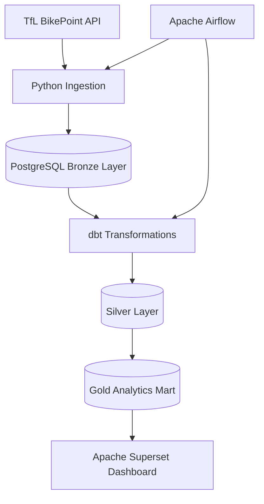

# Londoni jalgrattarendi koormuse dünaamika

## Äriküsimus

Millistes Londoni piirkondades tekib tipptundidel suurim rataste defitsiit ja milline on ratta asukohtade (dokkide) tühjenemise kiirus?

---

# Mõõdikud

## 1. Keskmine vabade rataste arv piirkonna kohta tipptundidel

### Kirjeldus
Näitab, kui palju rattaid on keskmiselt saadaval Londoni piirkondades tipptundide ajal.

### Ühik
rataste arv (tk)

### Ajavahemik
15 minuti või 1 tunni keskmine

### Kasutus
Võimaldab tuvastada piirkonnad, kus rataste defitsiit tekib kõige sagedamini.

---

## 2. Dokkide tühjenemise kiirus

### Kirjeldus
Näitab, kui kiiresti rataste arv jaamas väheneb valitud ajavahemiku jooksul.

### Ühik
ratast minutis (bikes/min)

### Ajavahemik
viimased 15–30 minutit

### Kasutus
Võimaldab leida kõige kiiremini tühjenevad BikePoint jaamad tipptundidel.

---

## 3. Kõrge riskiga jaamade arv

### Kirjeldus
Näitab, kui palju jaamu jõuab kriitilise rataste arvuni tipptundide ajal.

### Ühik
jaamade arv (tk)

### Ajavahemik
tipptunni jooksul

### Kasutus
Võimaldab hinnata, millistes piirkondades tekib suurim rataste puuduse risk.

---

## 4. Jaamade täituvusprotsent

### Kirjeldus
Näitab, kui suur osa jaama kogumahust on ratastega täidetud.

### Ühik
%

### Ajavahemik
hetkeseis või tunni keskmine

### Kasutus
Võimaldab võrrelda jaamade koormust erinevates Londoni piirkondades.

---

# Arhitektuuriskeem

---

# Andmeallikad ja muutuvus

## Transport for London BikePoint API

API:
https://api.tfl.gov.uk/BikePoint

### Kirjeldus
API tagastab Londoni rattarendi jaamade hetkeseisu andmed JSON kujul.

### Olulised väljad
- station_id
- station_name
- latitude
- longitude
- nbBikes
- nbDocks
- nbSpaces

### Muutuvus ajas
- andmed uuenevad ligikaudu kord minutis
- API annab ainult hetkeseisu
- ajalooline aegrida konstrueeritakse korduvate snapshot-päringutega
- kasutatakse inkrementaalset laadimist

---

# Esimesed tehnilised katsed

Esimeses etapis kontrollisime järgmised tehnilised eeldused:

1. TfL BikePoint API on ligipääsetav.
2. API tagastab BikePoint jaamade andmed JSON kujul.
3. API vastusest on võimalik välja lugeda vajalikud väljad:
   - station_id
   - station_name
   - latitude
   - longitude
   - nbBikes
   - nbDocks
   - nbSpaces
4. PostgreSQL andmebaas käivitub lokaalselt.
5. Andmebaasi ühendus töötab.
6. Esmane test näitas, et API-st saadud snapshot on võimalik andmebaasi salvestada.

---

# Planeeritud andmevoog

1. Apache Airflow käivitab regulaarse töövoo.
2. Python ingestion script pärib TfL BikePoint API-t.
3. API snapshot salvestatakse PostgreSQL bronze-kihis.
4. dbt teisendab andmed silver-kihi puhastatud tabeliteks.
5. dbt loob gold-kihi analüütilised tabelid.
6. Apache Superset kasutab gold-kihi tabeleid dashboardi visualiseerimiseks.

---

# Planeeritud andmekihid

## Bronze Layer
Toor API vastused JSON kujul.

### Näited väljadest
- load_timestamp
- raw_json
- source_url

---

## Silver Layer
Puhastatud snapshot-andmed.

### Näited väljadest
- snapshot_timestamp
- station_id
- station_name
- bikes_available
- docks_available
- total_capacity
- latitude
- longitude

---

## Gold Layer
Analüütilised tabelid dashboardi jaoks.

### Näited mõõdikutest
- avg_bikes_available
- depletion_rate
- utilization_percent
- high_risk_station_count

---

# Planeeritud visualiseeringud

1. Londoni kaart BikePoint jaamade koormusega.
2. Tipptundide line chart vabade rataste muutumise kohta.
3. Jaamade järjestus tühjenemise kiiruse järgi.
4. Heatmap piirkondade ja kellaaegade lõikes.

---

# Riskid

## 1. API kättesaadavus
API võib ajutiselt mitte vastata või rakendada päringupiiranguid.

## 2. Snapshot-andmete kiire kasv
Sagedased päringud võivad kiiresti suurendada andmemahtu.

## 3. API andmestruktuuri muutused
API väljade muutumine võib rikkuda ingestion või transformatsioonid.

---

# Riskide maandamine

1. API vigade korral kasutatakse retry-loogikat ja logimist.
2. Snapshotite päringusagedust saab vajadusel vähendada.
3. Toorandmed salvestatakse JSON kujul, et transformatsioone oleks võimalik uuesti käivitada.